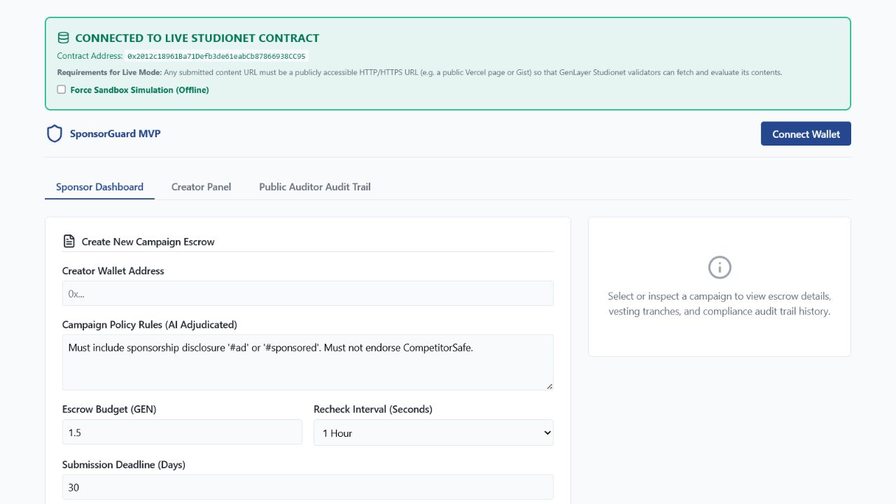

# SponsorGuard

SponsorGuard is a GenLayer Studionet escrow for influencer sponsorships. It releases a three-tranche campaign budget only while a submitted public post remains compliant with the sponsor's written policy, and it applies transparent refund and creator-bond rules when the post is warned, removed, or materially violates that policy.

## Verified deployment

| Item | Verified value |
| --- | --- |
| Network | GenLayer Studionet (chain ID `61999`) |
| Contract | [`0x2012c18961Ba71Defb3de61eabCb87866938CC95`](https://explorer-studio.genlayer.com/address/0x2012c18961Ba71Defb3de61eabCb87866938CC95) |
| Deployment transaction | [`0xaa536e421507497e483cd50e6b316bece714d8e52a04241dac34367427d53c54`](https://explorer-studio.genlayer.com/tx/0xaa536e421507497e483cd50e6b316bece714d8e52a04241dac34367427d53c54) (`FINALIZED`, GenVM `SUCCESS`, consensus `Accepted`) |
| Live app | [sponsorguard-buildgenlayer.vercel.app](https://sponsorguard-buildgenlayer.vercel.app) |

Studionet Campaign `#1` is a completed live smoke campaign. It escrowed `0.03 GEN`, accepted a `0.006 GEN` creator bond, evaluated the public compliant fixture three times, released all three tranches, and returned the bond. The verified write sequence is [create](https://explorer-studio.genlayer.com/tx/0xb147d179d337e4b29961c62ef52da6f9d8c7d24d8f0d1d0c778299c30f5fba83), [accept](https://explorer-studio.genlayer.com/tx/0x875008b3037697a3df165993adf7dcf2dc0c875f95070251a70d25514f0a3364), [submit URL](https://explorer-studio.genlayer.com/tx/0x8f65ef577af1d883a7e5e89cc2d89717f6156d79ebf844440fb924de5ca1c798), [baseline](https://explorer-studio.genlayer.com/tx/0xd90dcc0d9fe36b43ffb4c0d2100063fd1d7cee68497cf967b1e5d056b4ab92ef), [recheck 1](https://explorer-studio.genlayer.com/tx/0x07638dac28f427e16bb4d243ac084256e2c8113c0a74f6a8b45052aed7542ecd), and [recheck 2](https://explorer-studio.genlayer.com/tx/0x664e29460083cdd448ea0527a2e019ba8a3c6744a7020bf6b257be1bfac69519). Each adjudication finalized with GenVM `SUCCESS`, consensus `Accepted`, verdict `COMPLIANT`, and action `RELEASE`.



_Captured from the public production URL after wallet-compatibility release `c2ae2d0`. The image verifies the deployed interface and configured contract address; the Explorer links above provide the transaction evidence._

## Trust problem

A creator can publish a compliant sponsored post, receive payment, and later remove its disclosure or the post itself. A conventional backend leaves monitoring and enforcement under one party's control. SponsorGuard places the campaign funds, evaluation rules, verdict history, and payout consequences in an Intelligent Contract. GenLayer validators independently fetch the public URL and repeat the evaluation before accepting decision-critical fields.

## V1 flow

1. The sponsor calls `create_campaign` with a creator, policy, future deadline, recheck interval, and native GEN budget.
2. The named creator calls `accept_campaign` with a bond equal to exactly 20% of the budget.
3. The creator calls `submit_content` with a public HTTP or HTTPS URL.
4. Any account calls `evaluate_baseline`. The contract fetches the URL with `gl.nondet.web.get`, evaluates it against the stored policy, and stores check sequence 1.
5. Any account may call `request_recheck` after `next_check_at` and before the campaign deadline. V1 supports at most three total checks; it has no keeper or automatic scheduler.
6. After expiry, any account may call `settle_expired_campaign` for an eligible nonterminal campaign. Unpaid budget is refunded to the sponsor and any remaining creator bond is returned.

### Verdict and financial rules

| Verdict / action | Contract result |
| --- | --- |
| `COMPLIANT` / `RELEASE` | Releases the next unpaid tranche and sets `ACTIVE`; check 3 completes the campaign and returns the remaining bond. |
| `WARNING` / `HOLD` | Releases no tranche and sets `WARNING`; at check 3, all unpaid or held budget returns to the sponsor and the creator's bond is returned. |
| `MAJOR_VIOLATION` / `TERMINATE` | Terminates, refunds unpaid budget, sends 50% of the bond to the sponsor, and returns 50% to the creator. |
| `REMOVED` / `TERMINATE` | Terminates, refunds unpaid budget, and sends 100% of the remaining bond to the sponsor. |

The first two tranches are `floor(budget / 3)` and the third receives the exact remainder. A warning releases nothing; a later compliant check releases the next unreleased tranche, including a previously held tranche. At the terminal third check, every still-unreleased tranche is refunded to the sponsor. Native-value accounting uses integers throughout.

### State transitions

`OPEN -> ACCEPTED -> SUBMITTED -> EVALUATING -> ACTIVE/WARNING -> COMPLETED/TERMINATED`

An open campaign can become `CANCELED`. `EVALUATING` is transient; a failed nondeterministic evaluation restores the prior stable state. Expiry settlement moves an eligible `OPEN`, `ACCEPTED`, `SUBMITTED`, `ACTIVE`, or `WARNING` campaign to `COMPLETED` with the refund rules above.

## Why GenLayer is required

The core question is contextual: does the current content still comply with the campaign's natural-language disclosure and brand-safety policy? The leader produces a bounded JSON verdict after fetching the public URL. The validator path validates the schema, independently reruns the same web-and-LLM evaluation, and compares the stable decision fields `verdict` and `recommended_action`; explanatory wording may differ. This is substantive consensus, not format-only validation.

Inputs are treated as untrusted content, the response body is capped at 30,000 characters, and only four verdict/action combinations are accepted. These safeguards reduce ambiguity and prompt-injection risk but do not make arbitrary web retrieval or LLM judgment infallible.

## Contract interface

### Write methods

```text
create_campaign(creator: Address, policy: str, content_deadline: u256, recheck_interval: u256) -> u256  [payable]
cancel_campaign(campaign_id: u256) -> None
accept_campaign(campaign_id: u256) -> None  [payable]
submit_content(campaign_id: u256, content_url: str) -> None
evaluate_baseline(campaign_id: u256) -> None
request_recheck(campaign_id: u256) -> None
settle_expired_campaign(campaign_id: u256) -> None
```

### View methods

```text
get_campaign(campaign_id: u256) -> str
get_check(campaign_id: u256, sequence: u256) -> str
get_campaign_count() -> u256
```

The two string-returning views serialize JSON for the frontend.

## Frontend integration

The React application uses `genlayer-js` and the exported `studionet` chain. When `VITE_SPONSOR_GUARD_ADDRESS` is configured, wallet connection discovers OKX or another injected EIP-1193 provider, requests an account, adds or switches to Studionet, and passes that exact provider/account pair to the write client. It does not call MetaMask Snaps. The app reads the three view methods and sends all seven write methods to the configured contract. GEN inputs use `viem` `parseEther`/`formatEther` and `bigint`; there is no runtime fallback wallet or contract address.

Every live write follows this lifecycle:

```text
wallet signature -> PENDING -> PROPOSING -> COMMITTING -> REVEALING
                 -> ACCEPTED / READY_TO_FINALIZE -> FINALIZED
```

The UI reports success only after `FINALIZED` plus positive execution evidence: either SDK field `txExecutionResultName === FINISHED_WITH_RETURN` or Studionet's raw leader receipt `consensus_data.leader_receipt[0].execution_result === SUCCESS`. It reports evidenced execution errors, canceled transactions, validator/leader timeouts, and RPC exceptions without presenting them as success. If a finalized response contains neither execution representation, the UI labels the result unavailable, keeps the transaction hash, refreshes contract state, and tells the user to verify Explorer instead of falsely reporting a revert. Polling uses `getTransaction`, a 2-second production interval, and a 150-attempt ceiling (approximately five minutes). Successful rechecks also reload the selected campaign and all stored `get_check` records so the audit history stays synchronized with the counters. After a timeout, inspect the transaction hash in Explorer and refresh contract state before deciding whether to retry; do not blindly resubmit a value-bearing transaction.

If no contract address is configured, or if the user explicitly enables the switch, the UI enters a prominently labeled offline sandbox. Sandbox fixture controls are hidden in live mode and never count as on-chain evidence.

## Local setup

### Contract checks

From the repository root, using the existing Python environment:

```powershell
venv\Scripts\python.exe -m pytest -q
venv\Scripts\genvm-lint.exe lint contracts\sponsor_guard.py
venv\Scripts\genvm-lint.exe validate contracts\sponsor_guard.py
venv\Scripts\genvm-lint.exe check contracts\sponsor_guard.py
```

The verified local result is 18 passing contract tests plus passing GenVM lint, validation, and check gates.

### Frontend

```powershell
cd frontend
npm install
Copy-Item .env.example .env
# Set VITE_SPONSOR_GUARD_ADDRESS to a real deployed contract address.
npm run dev
```

Quality gates:

```powershell
npm test -- --run
npm run lint
npm run build
```

The verified local result is 16 passing Vitest tests, including OKX/EIP-1193 connection, Studionet addition/switching, rejection recovery, both typed and raw Studionet execution-result schemas, and post-recheck audit-history synchronization, plus a clean Oxlint run and successful production build.

## Deployment notes

The repository intentionally contains no automated contract-deployment script. The verified contract was deployed through GenLayer Studio to Studionet. A future contract deployment must use the current Studio-generated template and current official SDK/network configuration, wait for finality, verify execution success, then update the frontend environment and reviewer links with the new real address. Vercel Git integration builds the `frontend` directory after approved pushes to `main`; the reviewer-preparation release was deployed through that linked workflow.

## Trust boundaries and V1 limitations

- Only publicly retrievable HTTP/HTTPS content is suitable. Private, login-gated, anti-bot, and heavily client-rendered pages may fail.
- Rechecks are permissionless but manually triggered and timestamp-gated; continuous scheduling and randomized monitoring are not implemented.
- The contract stores verdict metadata, not a durable content snapshot or content hash.
- The policy is fixed per campaign in V1; there is no mutable or versioned policy registry.
- Local tests mock web, LLM, VM, and frontend SDK behavior. There is no automated end-to-end test against the deployed Studionet contract.
- Automated wallet tests use an OKX-shaped EIP-1193 mock. Campaign `#1` was also completed manually with OKX Wallet, but broad compatibility across wallet versions and devices has not been established.
- Studionet is a temporary development network and the current deployment should not be treated as production fund custody.
- The creator safety bond is application-level escrow. It is unrelated to GenLayer protocol validator staking.
- The production bundle currently exceeds Vite's default 500 kB chunk warning threshold.

See [ROADMAP.md](ROADMAP.md) for evidence-separated future work and [contracts/README.md](contracts/README.md) for contract-specific behavior.
